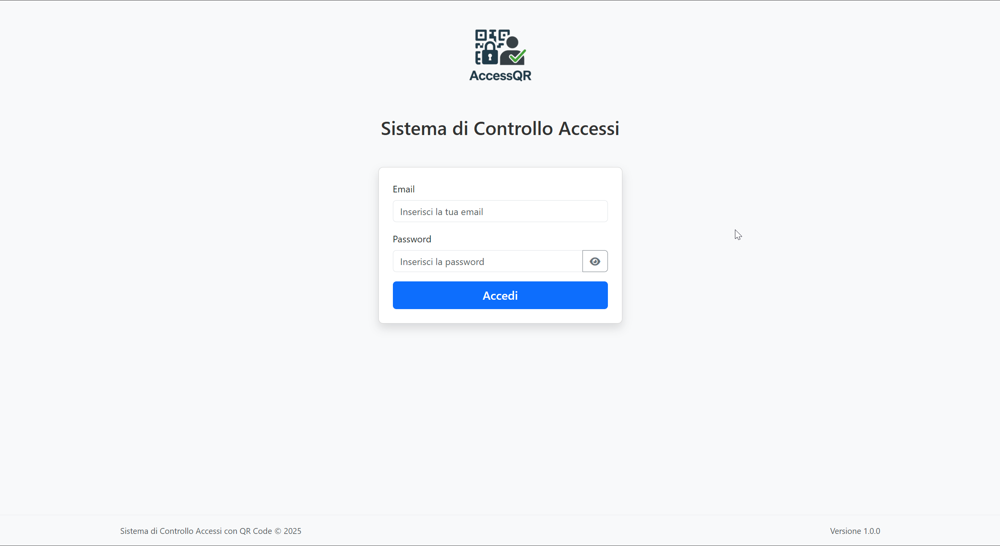
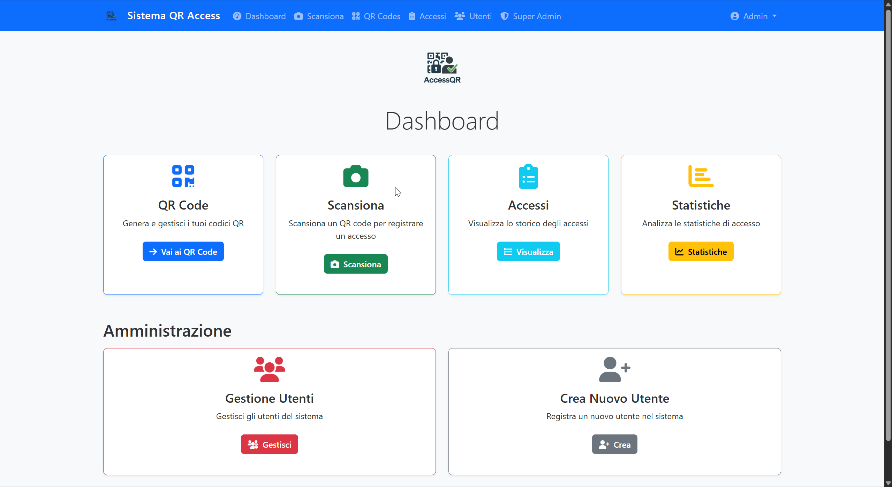
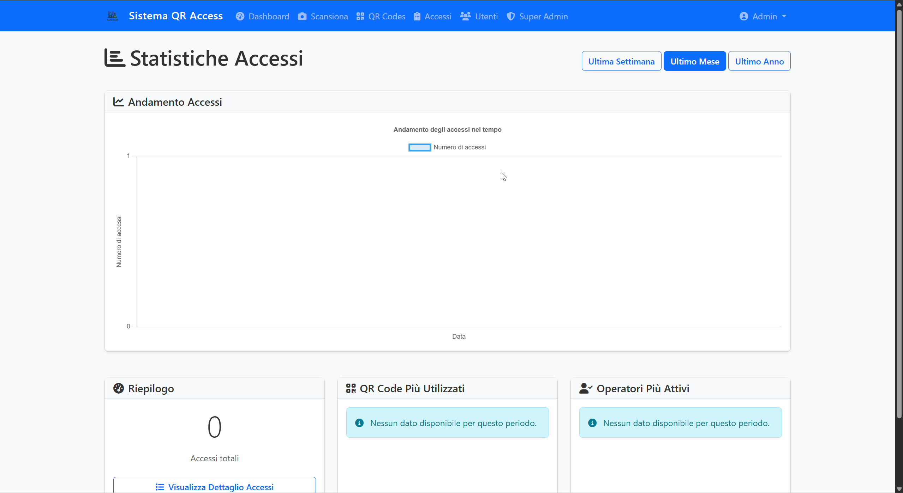

# Sistema di Controllo Accessi con QR Code

Un sistema web moderno per gestire gli accessi tramite QR code. Sviluppato con Flask, SQLAlchemy e Bootstrap 5, offre dashboard intuitive, gestione utenti e ruoli avanzata, log dettagliati, PWA installabile e funzioni amministrative complete.

---

## Screenshot

<div align="center">
  
  
  
</div>

---

## Indice

1. [Caratteristiche principali](#caratteristiche-principali)
2. [Requisiti](#requisiti)
3. [Struttura del progetto](#struttura-del-progetto)
4. [Installazione e configurazione](#installazione-e-configurazione)
5. [Avvio dell'applicazione](#avvio-dellapplicazione)
6. [Utenti di default](#utenti-di-default)
7. [Ruoli e permessi](#ruoli-e-permessi)
8. [Funzionalità avanzate](#funzionalit%C3%A0-avanzate)
9. [Progressive Web App (PWA)](#progressive-web-app-pwa)
10. [Database](#database)

---

## Caratteristiche principali

* **Generazione e gestione QR code**: crea codici associabili a utenti o a entità generiche.
* **Scansione QR code**: via webcam o browser, senza app aggiuntive.
* **Log accessi**: registra ogni ingresso con timestamp, geolocalizzazione e dettagli.
* **Dashboard e statistiche**: grafici e tabelle per monitorare utilizzi e trend.
* **Gestione utenti & ruoli**: Super Admin, Admin, Operatore e Utente.
* **Controllo avanzato (Super Admin)**: modifica/eliminazione massiva di QR code e accessi.
* **Log di sistema**: tracciamento di tutte le operazioni interne.
* **Interfaccia responsive**: basata su Bootstrap 5.
* **PWA**: installabile, funzionamento offline e mobile-friendly.

---

## Requisiti

* Python 3.8 o superiore
* Virtualenv (consigliato)
* Flask e estensioni (vedi `requirements.txt`)
* Database:

  * **Sviluppo**: SQLite (default)
  * **Produzione**: MySQL o PostgreSQL
* Browser moderni: Chrome, Edge, Firefox

---

## Struttura del progetto

```
controllo-accessi-flask/
├── app/
│   ├── __init__.py            # Factory Flask
│   ├── models.py              # Definizioni modelli DB
│   ├── auth/                  # Login & registrazione
│   ├── qr_codes/              # Generazione QR code
│   ├── accesses/              # Gestione accessi
│   ├── users/                 # CRUD utenti
│   ├── main/                  # Dashboard e home
│   ├── static/                # CSS, JS, immagini, manifest.json
│   └── templates/             # Template Jinja2
├── config.py                  # Configurazioni dell'app
├── requirements.txt           # Dipendenze Python
├── run.py                     # Avvio applicazione
├── setup_db.py                # Inizializzazione/reset DB
├── README.md                  # Documentazione (questo file)
└── README_DATABASE.md         # Dettagli gestione database
```

---

## Installazione e configurazione

1. Clona il repository:

   ```bash
   git clone https://github.com/tuo-utente/controllo-accessi-flask.git
   cd controllo-accessi-flask
   ```
2. Crea ed attiva un ambiente virtuale Python:

   ```bash
   python -m venv venv
   source venv/bin/activate   # Linux/macOS
   venv\Scripts\activate      # Windows
   ```
3. Installa le dipendenze:

   ```bash
   pip install -r requirements.txt
   ```
4. Inizializza e popola il database:

   ```bash
   python setup_db.py
   ```

---

## Avvio dell'applicazione

```bash
flask run
```

Visita `http://localhost:5000` nel tuo browser.

---

## Utenti di default

* **Super Admin**: `superadmin@example.com` / `super123`
* **Admin**: `admin@example.com` / `admin123`

---

## Ruoli e permessi

| Ruolo       | Permessi principali                                          |
| ----------- | ------------------------------------------------------------ |
| Super Admin | Accesso completo, gestione avanzata, reset DB, modifica dati |
| Admin       | Gestione utenti, QR code, accessi e statistiche              |
| Utente      | Scansione QR code, modifica password                         |

---

## Funzionalità avanzate (Super Admin)

* Reset del database (tranne utenti)
* Modifica e cancellazione dei QR code e dei record di accesso
* Ricerca avanzata e gestione massiva dei dati

---

## Progressive Web App (PWA)

* Installabile su dispositivi mobili
* Funzionalità offline per operazioni principali (scansione e log)

---

## Database

Per dettagli aggiuntivi sulla configurazione e gestione del database, consulta `README_DATABASE.md`.
